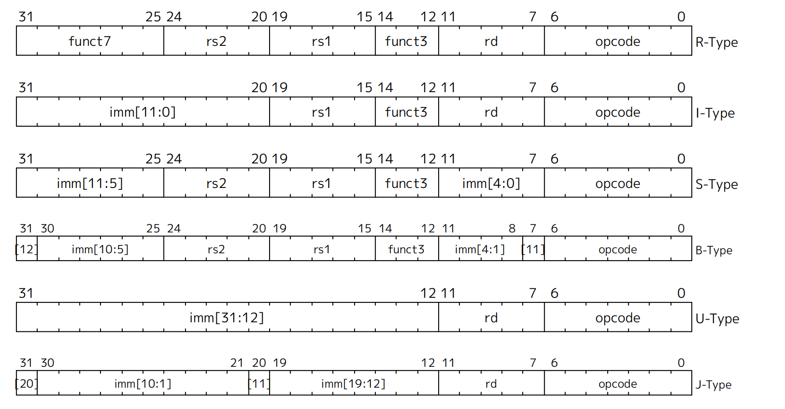

## 指令格式总览

## RISC-V NOP 指令

NOP（No Operation）指令在 RISC-V 中通常是 `ADDI x0, x0, 0`，即 I-type 指令，不改变任何状态。

| 指令 | opcode (6:0) | funct3 (14:12) | imm[11:0] | rs1 | rd | 编码 (32-bit) | 语义 |
|---|---|---|---|---|---|---|---|
| NOP | 0b0010011  | 000 | 000000000000 | 00000 (x0) | 00000 (x0) | 0x00000013 | x0 = x0 + 0 (无操作) |

如果本工程使用 R-type NOP，即：

| 指令 | opcode (6:0) | funct3 (14:12) | funct7 (31:25) | rs2 | rs1 | rd | 编码 (32-bit) | 语义 |
|---|---|---|---|---|---|---|---|---|
| NOP | 0b0110011  | 000 | 0000000 | 00000 (x0) | 00000 (x0) | 00000 (x0) | 0x00000033 | x0 = x0 + x0 (无操作) |

## RISC-V R-type 指令（简版）

下表列出本工程当前计划支持的一些基础 R-type 指令，对应编码与 ALU 行为：

| 指令 | opcode (6:0) | funct3 (14:12) | funct7 (31:25) | 语义 | ALU 动作 |
|---|---|---|---|---|---|
| ADD | 0b0110011  | 000 | 0000000 | rd = rs1 + rs2 | ADD |
| SUB | 0b0110011  | 000 | 0100000 | rd = rs1 - rs2 | SUB |
| AND | 0b0110011  | 111 | 0000000 | rd = rs1 & rs2 | AND |
| OR  | 0b0110011  | 110 | 0000000 | rd = rs1 | rs2 | OR  |
| XOR | 0b0110011  | 100 | 0000000 | rd = rs1 ^ rs2 | XOR |
| SLT | 0b0110011  | 010 | 0000000 | rd = (rs1 < rs2)?1:0 (有符号) | SLT |

说明：
- R-type 格式：`{funct7[31:25], rs2[24:20], rs1[19:15], funct3[14:12], rd[11:7], opcode[6:0]}`。
- 本工程 ALU 已具备上述操作；控制单元将按 opcode/funct3/funct7 组合选择对应 ALU 控制码。
- x0 恒为 0（硬连 0），对 x0 的写回将被忽略（符合 RISC-V 规范）。

